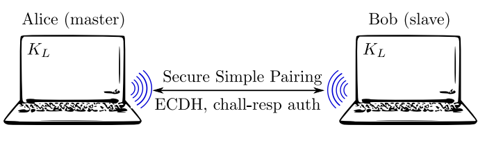
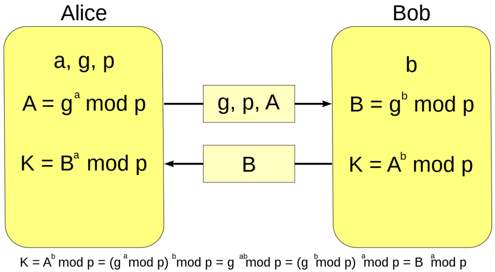
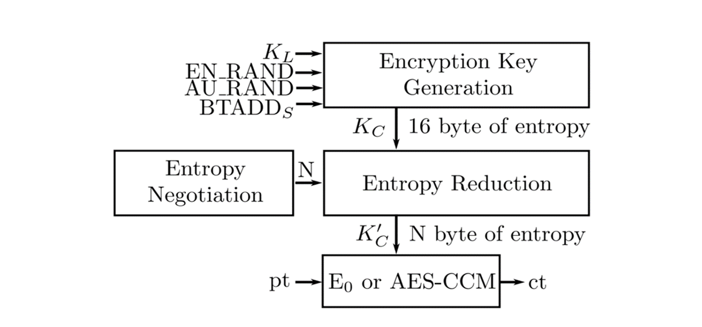
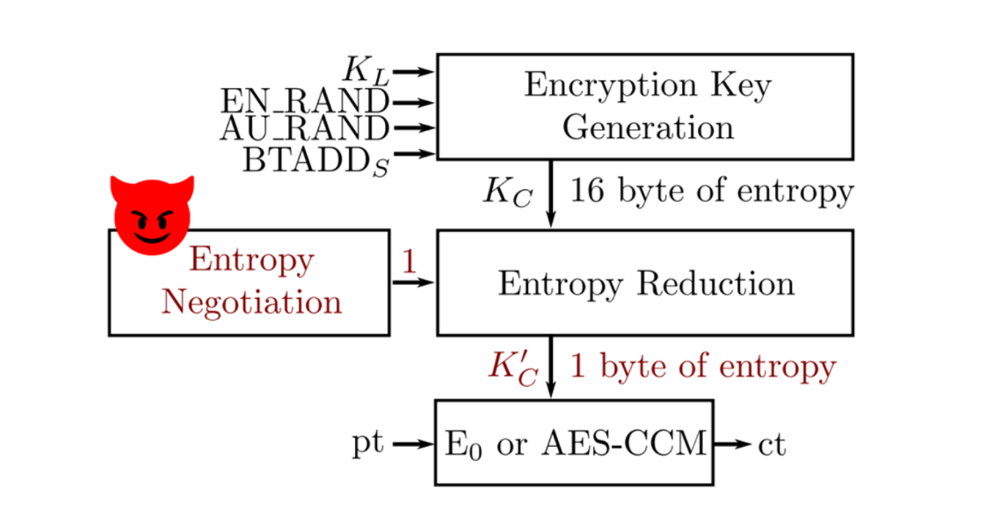

# Механизм установления соединения в Bluetooth BR/EDR с описанием уязвимостей

## Введение

Bluetooth является одним из самых популярных беспроводных протоколов, который применяется для обмена данными между
устройствами в непосредственной близости друг от друга. Устройства Bluetooth занимают центральное место в развитии
передовых технологий. Эта технология с батарейным питанием работает со всеми гаджетами умного дома, наушниками и
практически с любым другим устройством. Люди использовали технологии для беспроводной передачи информации с одного
устройства на другое ещё до изобретения мобильных телефонов. Таким образом, в большинстве случаев Bluetooth более
безопасен, чем Wi-Fi. Однако, как и любая технология, Bluetooth может иметь уязвимости, которые могут быть использованы
злоумышленниками для несанкционированного доступа к устройствам или перехвата данных.

Bluetooth BR/EDR (Bluetooth Basic Rate/Enhanced Data Rate) 5.0 - это последняя версия Bluetooth, которая обеспечивает
более высокую скорость передачи данных и улучшенную энергоэффективность.

Разработан еще также BLE (Bluetooth Low Energy). Существует большая разница между "классическим" Bluetooth и Bluetooth с
низким энергопотреблением с точки зрения технических спецификаций, реализации и типов приложений, для которых они
предназначены. Кроме того, они несовместимы друг с другом.

BT classic:

- используется для потоковых приложений, таких как трансляция аудио- и видео-контента и непрерывная передача данных,
  например аудиоколонки;

- не оптимизирован для низкого энергопотребления, но поддерживает большую скорость передачи;

- использует 79 радиоканалов;

- обнаружение происходит на 32 каналах.

BLE:

- используется в сенсорах и для управления устройствами и приложениями, не требующими передачи больших объемов данных;

- предназначен для применения в малопотребляющих устройствах с большими интервалами между передачей данных, например в
  садовых датчиках, которые отправляют небольшой объём данных 1-2 раза в день;

- использует 40 радиоканалов;

- обнаружение происходит на 3 каналах, что приводит к более быстрому обнаружению и установке соединения.

В данной статье будем рассматривать только Bluetooth BR/EDR.

## Этапы установления безопасного соединения

1. Генерация ключа безопасности
2. Аутентификация
3. Безопасный обмен данными

### Генерация ключа безопасности

Связь нескольких устройств начинается с генерации секретного ключа, который включает: 48-битный MAC-адрес, PIN-код и
случайную величину. Устройства обмениваются сгенерированными значениями и вычисляют link key(ключ безопасности). Эту
процедуру сопряжения называют парингом.

Для безопасного простого сопряжения двух устройств на первом этапе используется метод эллиптических кривых
Диффи-Хеллмана. Эта пара ключей должна быть сгенерирована вначале сопряжения и обычно используется до конца, и первое и
второе устройство в любой момент времени могут отказаться от пары сгенерированных ключей и создать новую пару, начав при
этом весь процесс сопряжения сначала.

Сам алгоритм состоит из этапов:

1. Выбираются общие параметры
2. Генерируются публичные ключи
3. Вычисляется секретный ключ К, который как можно увидеть снизу картинки равен у обоих пользователей.

#### Пример создания секретного ключа

Допустим, Алиса и Боб хотят создать общий секретный ключ, используя алгоритм Диффи-Хеллмана. Они выполняют следующие
шаги:

1. Алиса и Боб выбирают общие параметры: основание g (допустим, 5) и большое простое число p (допустим, 23).
2. Алиса генерирует свой секретный ключ a (допустим, 6) и вычисляет свой публичный ключ A:
   A = g^a mod p = 5^6 mod 23 = 15625 mod 23 = 8.
3. Боб генерирует свой секретный ключ b (допустим, 9) и вычисляет свой публичный ключ B:
   B = g^b mod p = 5^9 mod 23 = 1953125 mod 23 = 11.
4. Алиса и Боб обмениваются публичными ключами: Алиса отправляет свой ключ A (8) Бобу, а Боб отправляет свой ключ B (11)
   Алисе.
5. Алиса вычисляет общий секретный ключ s:
   s = B^a mod p = 11^6 mod 23 = 1771561 mod 23 = 9.
6. Боб вычисляет общий секретный ключ s:
   s = A^b mod p = 8^9 mod 23 = 134217728 mod 23 = 9.

Теперь Алиса и Боб имеют общий секретный ключ s, который равен 9. Этот ключ может быть использован для дальнейшего
зашифрования и расшифрования сообщений между ними.

На этапе паринга присутствует не так много уязвимостей, так как сгенирируемый ключ безопасности на прямую не
используется в шифровании и обмене данными. Однако наиболее популярной уязвимостью является BlueSmack. BlueSmacking –
это метод запуска DoS-атаки на устройство с поддержкой Bluetooth. Злоумышленник перехватывает ключ безопасности и
подключается к атакуемому устройству. Дальше хакер отправляет на цель гораздо больше пакетов данных, чем она может
обработать. Цель становится перегруженной и отключается.

### Что такое энтропия?

Перед рассмотрением этапа аутентификации рассмотрим понятие Энтропии. Информационная энтропия – это мера
неопределённости или непредсказуемости информации, неопределённость появления какого- либо символа алфавита.

Иными словами, сколько вариаций ключа может быть. Чем больше бит ключ занимает, тем больше его вариаций может быть ->
тем больше энтропия ключа. В нашем случае энтропия – количество байт в ключе (Энтропия 1 = 1 байт).

### Аутентификация

На данном этапе паринг заканчивается и начинается этап инициализации bluetooth соединения — Mutual authentication, или
взаимная аутентификация. Основана она на схеме «запрос-ответ».

Каждый раз, когда для подключения Bluetooth требуется шифрование на канальном уровне, Алиса и Боб вычисляют ключ
шифрования KC(его можно назвать ключ сессии) на основе KL, BT_ADDR, AU_RAND и EN_RAND. KL — это ключ связи,
установленный во время безопасного простого сопряжения,BT_ADDR-адрес одного из устройств, AU_RAND-случайное число для
аутентификации, EN_RAND-случайное число для шифрования. Предполагая идеальную генерацию случайных чисел, энтропия KC
всегда равна 16 байтам. KC напрямую не используется в качестве ключа шифрования для текущего сеанса. Фактический ключ
шифрования, обозначенный символом K’C(ключ шифрования) вычисляется путем уменьшения энтропии KC до N байт. Это
необоходимо, так как Bluetooth используется повсеместно на совершенно различных устройствах и каждое устройство обладает
разной производительностью, например, садовый датчик не хранит 16 байт ключа, так как не способен работать с таким
количеством данных. Данное N согласно спецификации может быть от 1 до 16 байт, на этом этапе и рождается уязвимость,
названная KNOB-атака.

Смысл данной атаки заключается в том, что хакер устанавливает энтропию ключа(N) равной 1, дальше обычным перебором находит необходимый ключ и перехватывает данные в процессе обмена между двумя устройствами.

### Уязвимости на этапе общения

Уязвимости, который относятся к этапу обменом сообщений, связаны с этапом аутентификации, так как необходимо перехватить
зашифрованные параметры, которые генерируются именно предыдущем этапе. Приведу пример таких уязвимостей.

#### Атака Bluebugg

Bluebugging создает бэкдор на телефоне или ноутбуке жертвы с помощью Bluetooth. Бэкдоры опасны, потому что они позволяют
враждебному постороннему пользователю получить доступ к вашему устройству и конфиденциальным данным изнутри.

Они могут использовать бэкдор, чтобы отслеживать ваши действия. Они могут даже выдавать себя за вас в социальных сетях
или следить за вами когда вы работаете с онлайн-банком.

#### Атака BlueSnarf

BlueSnarfing происходит, когда хакер подключается к вашему смартфону через Bluetooth и получает от него информацию без
вашего разрешения или ведома, такую как контактные номера, адреса электронной почты или события календаря.

Хотя название может звучать достаточно безобидно, BlueSnarfing на самом деле представляет серьезную угрозу безопасности.
Поскольку для этого не требуется никакого физического контакта с устройством, это может быть сделано без ведома жертвы.
А поскольку радиус действия Bluetooth достигает 10 метров, злоумышленник может сидеть в соседней машине или даже стоять
на другой стороне улицы и все равно получить доступ к вашим данным.

## Как защитить свои данные

1. Самый простой способ обезопасить себя – поддерживать систему в актуальном состоянии сразу после выхода новых
   исправлений. Google и Amazon, например, опубликовали патчи при обнаружении уязвимости BlueBorne, защитив
   пользователей от подобных атак.
2. Также важно выбирать устройства, которые используют самую последнюю версию Bluetooth, как и обновления безопасности.
   Например, отслеживание Bluetooth было отключено только в версии 4.0. Новейший стандарт, версия 5.0, автоматически
   используется на новых устройствах. Но, Вам придётся купить новый гаджет, поскольку установка более поздней версии
   Bluetooth на старом устройстве невозможна.
3. Лучше всего включать Bluetooth именно тогда, когда вам это нужно, чтобы сэкономить заряд батареи вашего телефона и
   лучше защитить себя от нападений.
4. Можно настроить своё устройство таким образом, чтобы для установления нового соединения требовался пин-код. В
   результате этого становится практически невозможно обмануть ваш телефон и заставить его установить новое соединение.
5. Настройте своё устройство так, чтобы вы могли подключаться только к известным устройствам, чтобы защитить соединение
   Bluetooth. Вы можете сделать это в настройках Bluetooth. Эта процедура препятствует попыткам создания нежелательных
   соединений с новыми устройствами.
